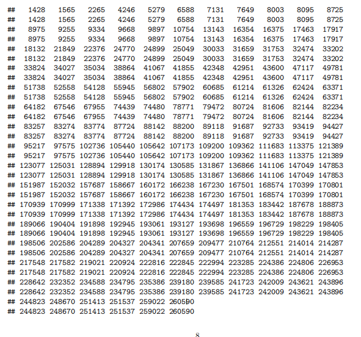
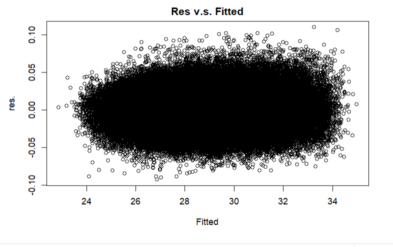

```{r setup, include=FALSE}
knitr::opts_chunk$set(echo = TRUE)
#tinytex::install_tinytex()
library(tidyverse)
library(ggplot2)
library(readr)
library(dplyr)
library(kableExtra)
library(haven)
library(usmap)
library(car)
library(broom)
library(patchwork)
```


# Introduction
The overweight rate of a country is vital for society and plays such an indisputably important role in human life. The rising overweight rates in developed countries have brought continuous challenges to their policymakers. The United States of America, as one of the most powerful nations around the world, has been facing the highest overweight rate overall OECD Countries in the past decades(@OECD).Over 36.2% of population is overweight in 2017. Further investigation into what causes such a high rate and how the overweight rate impacts individuals’ lives is urgent.\
A regular daily routine, including sleep and exercise, are essential to a healthy life(@exercise). We all know that energy is counted in calories. Too many calories in but fewer calories burned will cause energy imbalance and lead to overweight Highly active and sedentary individuals have a significant difference in their weight if we remove other factors and group them appropriately. Mental health is straightly related to one’s overweight as well. Individuals with PTSD were 5% less likely to have healthy diets(@mental). In the long run, it will destroy various body functions, resulting in the accumulation of fat in the body, thereby causing overweight Besides, pregnancy for women and alcohol for men are also very strong relevance to the overweight rate. The recent data and analysis from the mentioned factors conducted in America remain inadequate. There is also a cross-sectional study indicating that heavy drinking could cause excess body weight(@Alcohol) and the fact is that 1 gram of alcohol provides 29 kJ energy.\
This paper examines the overweight factors all over America. The results suggest that females who drink alcohol, do not smoke, and exercise could have higher BMI. Additionally, sleeping time, age, self-rated health are three numerical factors that increase BMI. Last but not least, the West coast has a lower BMI than the East coast.
The remaining part of the paper was organized into four major sections. In the Data section, there is the explanation of the source of the basic data, the data characteristic and exploratory data analysis. By using the multiple linear regression, I form a model to explain the factors of BMI. Other than that, two maps are used to show the BMI regional differences exist and the health spending per capita is inversely proportional to overweight. Finally, an appendix apply some supplementary results.


\newpage
# Data
The dataset I used in this report is the “Overall version data weighted with _LLCPWT,” which was collected by The Behavioral Risk Factor Surveillance System (@BRFSS). The Behavioral Risk Factor Surveillance System is an important foundational project supported by the Centers for Disease Control and Prevention’s Population Health Surveillance Branch, under the Division of Population Health at CDC’s National Center for Chronic Disease Prevention and Health Promotion. BRFSS aims to collect data on health-related risk behaviors in the United States. The target population is 18 years or older who live in their own house in the United States. Every questionnaire has 3 different modules: a core component, a standard set of questions that all states use, optional BRFSS modules that are the questions on specific topics that states elect, and  State-added questions that states select but CDC does not edit or track responses from these questions. In the 2020 annual survey, there were 401958 in 53 different states or territories responses. The Data Collection is based on Computer-Assisted Telephone Interview (CATI) systems that could provide an individual questionnaire for the interviewer and finish the procedure in 15 minutes.

```{r,include=FALSE, echo = FALSE, message = FALSE, warning = FALSE}
#ll <- read_xpt("LLCP2020.XPT")
```
```{r,include=FALSE, echo = FALSE, message = FALSE, warning = FALSE}
amobesity <- read_csv("tmp.csv")
amobesity
states <- read.csv("state_births.csv")
data_full <- read.csv("datafull.csv")
```
```{r,include=FALSE, echo = FALSE, message = FALSE, warning = FALSE}
raw_data <- read.csv("raw_data (1).csv")
```
The dataset was processed and analyzed in R[@R1] and I analyzed all these using R package including: readr[@readr], tidyverse[@tidyverse], kableExtra[@kableExtra],ggplot2[@ggplot2], dplyr[@dplyr], kableExtra[@kableExtra], car[@car], patchwork[@patchwork] and broom[@broom].\
```{r,include=FALSE, echo = FALSE, message = FALSE, warning = FALSE}
"
data_full <- ll %>% select (`_BMI5`,SLEPTIM1,GENHLTH,ALCDAY5,SEXVAR, `_RFSMOK3`,`_AGEG5YR`,EXERANY2,DRNKANY5, `_MENT14D`) %>% filter(!is.na(`_BMI5`) & !is.na(ALCDAY5)& !is.na(`_RFSMOK3`)& !is.na(SLEPTIM1)& !is.na(GENHLTH)& !is.na(SEXVAR) &SLEPTIM1<24 &`_MENT14D` < 9 &SLEPTIM1>1 &GENHLTH<7 & `_RFSMOK3` <3 &`_AGEG5YR`<14& EXERANY2 < 7 & DRNKANY5<7& ALCDAY5<900 & ALCDAY5 != 777) %>% 
  mutate(ALCDAY5 = case_when(ALCDAY5 < 200 ~ ALCDAY5-100,
                           ALCDAY5 > 200 & ALCDAY5<300 ~ ALCDAY5-200,
                           ALCDAY5>300  ~ ALCDAY5 -888),
      `_BMI5` = `_BMI5` /100)
set.seed(000)
N=nrow(data_full)
for (i in 1:N){
if (data_full$`_AGEG5YR`[i] == 1)
  data_full$`_AGEG5YR`[i] = sample(x = 18:24, size  = 1)
else if (data_full$`_AGEG5YR`[i] == 2)
  data_full$`_AGEG5YR`[i] = sample(x = 25:29, size  = 1)
else if (data_full$`_AGEG5YR`[i] == 3)
  data_full$`_AGEG5YR`[i] = sample(x = 30:34, size  = 1)
else if (data_full$`_AGEG5YR`[i] == 4)
  data_full$`_AGEG5YR`[i] = sample(x = 35:39, size  = 1)
else if (data_full$`_AGEG5YR`[i] == 5)
  data_full$`_AGEG5YR`[i] = sample(x = 40:44, size  = 1)
else if (data_full$`_AGEG5YR`[i] == 6)
  data_full$`_AGEG5YR`[i] = sample(x = 45:49, size  = 1)
else if (data_full$`_AGEG5YR`[i] == 7)
  data_full$`_AGEG5YR`[i] = sample(x = 50:54, size  = 1)
else if (data_full$`_AGEG5YR`[i] == 8)
  data_full$`_AGEG5YR`[i] = sample(x = 55:59, size  = 1)
else if (data_full$`_AGEG5YR`[i] == 9)
  data_full$`_AGEG5YR`[i] = sample(x = 60:64, size  = 1)
else if (data_full$`_AGEG5YR`[i] == 10)
  data_full$`_AGEG5YR`[i] = sample(x = 65:69, size  = 1)
else if (data_full$`_AGEG5YR`[i] == 11)
  data_full$`_AGEG5YR`[i] = sample(x = 70:74, size  = 1)
else if (data_full$`_AGEG5YR`[i] == 12)
  data_full$`_AGEG5YR`[i] = sample(x = 75:79, size  = 1)
else
  data_full$`_AGEG5YR`[i] = sample(x = 80:99, size  = 1)
}"
```

## Data Characteristic

```{r, echo = FALSE, message = FALSE, warning = FALSE}
 data_full%>% ggplot(aes(x = X_BMI5)) +
geom_histogram(bins = 30, color = "black", fill = "#2a71e2") +
theme_classic()+
labs(x = "BMI", title = "Fig.1 Histogram of Body Mass Index
     for each respondent.")
```
```{r, echo = FALSE, message = FALSE, warning = FALSE}
table1 <- data_full %>% summarise(mean = mean(X_BMI5),
                                  min = min(X_BMI5),
                             `1st Qu.` = quantile(X_BMI5, 0.25),
                             median = median(X_BMI5),
                             `3st Qu.` = quantile(X_BMI5, 0.75),
                             max = max(X_BMI5),
                             IQR = `3st Qu.` -`1st Qu.`,
                             sd = sd(X_BMI5),
                             small_outliers = sum(X_BMI5< `1st Qu.` -1.5*IQR),
                             large_outliers = sum(X_BMI5> `3st Qu.` +1.5*IQR)) %>% 
  kable(caption = "summary statistic of Body Mass Index") %>%
  kable_classic(full_width = F, html_font = "Cambria") %>%
  kable_styling(latex_options = "HOLD_position")
table1
```

In total, this dataset spans 280 columns which include 17 different main aspects. After filtering the missing and invalid values, there were 332479 rows remaining and  I selected the Body Mass Index as my responsible variable. That is because BMI is defined as weight divided by the square of height. It is an indicator of overall nutritional status, and BMI is statistically highly correlated with body fat. Figure 1 reflects the distribution of the Body Mass Index. The BMI is right-skewed and single-peaked, which means most Americans have a score of BMI under 50, and concentrated around 25. Combined with Table1, the mean is about 28 and the median is 27.34. There are varied large outliers on the right tail and only 41 small outliers on the left tail, which are great facts to justify from the Figure1. Since the height and weight was collected directly from the answer of the respondent and most of the respondent would like to give an inflated height and a lower weight(@BMIbias), the BMI shows could be smaller than the reality.  
```{r, echo = FALSE, message = FALSE, warning = FALSE}
data_fact1<- data_full%>% ggplot(aes(x = SLEPTIM1)) +
geom_histogram(bins = 30, color = "black", fill = "#1b98e0") +
theme_classic()+
labs(x = "sleeping time", title = "Histogram of sleeping time
     for each respondent.")
```
```{r, echo = FALSE, message = FALSE, warning = FALSE}
data_fact2<- data_full%>% ggplot(aes(x = GENHLTH)) +
geom_histogram(bins = 30, color = "black", fill = "#1b98e0") +
theme_classic()+
labs(x = "health rate", title = "Histogram of general self rated health
     for each respondent.")
```
```{r, echo = FALSE, message = FALSE, warning = FALSE}
data_fact3<- data_full%>% ggplot(aes(x = X_AGEG5YR)) +
geom_histogram(bins = 30, color = "black", fill = "#1b98e0") +
theme_classic()+
labs(x = "Age", title = "Histogram of Age 
     for each respondent.")
```
```{r, echo = FALSE, message = FALSE, warning = FALSE}
data_fact4<- data_full%>% ggplot(aes(x = ALCDAY5)) +
geom_histogram(bins = 30, color = "black", fill = "#1b98e0") +
theme_classic()+
labs(x = "alcohol days", title = "Histogram of drinking alcohol days
     for each respondent.")
```
```{r, echo = FALSE, message = FALSE, warning = FALSE}
g_all <- (data_fact1|data_fact2)/
(data_fact3|data_fact4)+   
  plot_annotation(title = "Fig.2 Four numerical Indicators") & 
  theme(plot.title = element_text(hjust = 0.5))
g_all
data_full%>% select(SLEPTIM1,GENHLTH,X_AGEG5YR,ALCDAY5) %>% summary()%>%
  kable(caption = "summary statistic of Four numerical Indicators") %>%
  kable_classic(full_width = F, html_font = "Cambria") %>%
  kable_styling(latex_options = "HOLD_position")
```
\newpage
Besides the responsible variable, there are 8 interesting variables,SLEPTIM1,GENHLTH, ALCDAY5, SEXVAR, X_RFSMOK3, X_AGEG5YR, EXERANY2, DRNKANY5. Figure 2 shows all four interesting numerical reasons that may affect the Body Mass Index. Panel A is called the “sleeping time for each respondent”. It is generated by SLEPTIM1 and represents the total sleeping time every day for each respondent. The sleeping time is right-skewed and single-peaked which means almost all of Americans sleep under 10 hours From the table, I found the median of sleep time is 7 hours and  mean is 7.1 which is a healthy duration since most adults need 7 to 9 hours or less. There is some extreme value on the right tail, which is over 20 hours. But considering there is some illnesses, such as Kleine-Levin Syndrome could cause this result(@Syndrome), I did not filter them.\
Panel B is called "the general self-rated health for each respondent”. The data is calculated from GENHLTH and represents self-rated general health in 5 different grades. where 1 means “Excellent” and 5 means “poor.” All respondents are required to answer the question, “Would you say that in general your health is?” The sleeping time is right-skewed and single-peaked as well. The median is 2 and the mean is 2.4, which means most of the citizens have an above Good feeling about their life. The major responses are concentrated in the score of 2 and 3, which is because the Americans may not be prone to give extremely worse emotional expressions when rating their feeling about life.\
Panel C is the age of each respondent. Since the original data only provided 13  five-year age categories, X_AGEG5YR, I randomly assigned the age for each respondent in all 13 groups separately. In the plot, The shape is symmetric and single-peaked. The median is 57 years old and the mean is 55 years old. Panel D is the alcohol each respondent drinks every day and the variable name is ALCDAY5. All respondents must answer the question, “During the past 30 days, how many days did you have at least one drink of any alcoholic beverage?” The alcohol drinking is right-skewed and single-peaked and can be proved by the median on the table, which is only 1 and the mean is 3.882. So, most Americans do not drink at all.
```{r, echo = FALSE, message = FALSE, warning = FALSE}
data1 <- data_full %>% count(DRNKANY5, sort = TRUE)
data2 <- data_full %>% count(SEXVAR, sort = TRUE)
data3 <- data_full %>% count(X_RFSMOK3, sort = TRUE) 
data4 <- data_full %>% count(EXERANY2, sort = TRUE)
character <- c("drink alcohol or not ", "Male or Female", "smoke or not", "exercise or not")
Yes_or_male <- c(175014, 158151, 46466, 256270)
No_or_female <- c(157465, 174328, 286013, 76209)
df <- data.frame(character, Yes_or_male,No_or_female )
df.long <- gather(df, variable,count, -character) 
ggplot(data = df.long, aes(x = character, y = count, fill = variable)) +
  geom_col(position = position_dodge()) +
labs(title = "Fig.3 Barplot of four categorical variables")
```
The figure 3 above is the Barplot of four interesting categorical variables, from left to right is "drink alcohol or not ", "Male or Female", "smoke or not", and "exercise or not". Each of them has 2 levels shown on the graph. For exercise and smoking, It is fairly apparent that most of the people exercise regularly and have no smoking habit. Other than that, about half of the population is male and about 170000 is abstinent.


```{r, echo = FALSE, message = FALSE, warning = FALSE}
set.seed(000)
# Count the number of observations in the data
n <- nrow(data_full)
# Randomly choose 80% as training
training <- sample(1:n, size=round(0.8*n))
# Add a column called "rowid" to our original data
data_full <- data_full %>% rowid_to_column()
# Create a training set
train <- data_full %>% filter(rowid %in% training)
# Create a testing set
test <- data_full %>% filter(!(rowid %in% training))
```

## Methodology
This study aims to find the most relevant variables with a linear relationship with Body Mass Index, so a linear regression model is applied. 
Linear regression is a statistical analysis method that uses regression analysis in mathematical statistics to determine the interdependent relationship between two or more variables,dependent variables and multiple other independent variables. Here, I have more than one variable, so the process is called multiple linear regression. Since the model parameters are unknown we could estimated from the data by using linear predictor functions. It is expressed extensively in the form of y = w'x + y’z+e, where e is a normal distribution with a mean of 0 and is ignorable.

The model assumes that: 
 $$Y = \beta_0 +\beta_1*SLEPTIM1+ \beta_2*GENHLTH + \beta_3*SEXVAR + \beta_4 *X_RFSMOK3 + \beta_5 *X_AGEG5YR$$
$$ + \beta_6 *EXERANY2+\beta_7*DRNKANY5 $$
where, Y : the response variable: Body Mass Index\
$\beta_0$ = the interaction term where every independent variable is equal to 0\
$\beta_1$ = the expected change of Y for an unit increase in  sleeping time\
$\beta_2$ = the expected change of Y for an unit increase in  general health\
$\beta_3$ = the expected change of Y for an unit increase in  age\
$\beta_4$ = the expected change of Y for the value of the sex\
$\beta_5$ = the expected change of Y for the value of the smoking \
$\beta_6$ = the expected change of Y for the value of the exercise\
$\beta_7$ = the expected change of Y for the value of the drinking alcohol\

There are seven variables of interest for my multiple linear regression model. In general, there are two types of linear regression models that can be plotted, one is several parallel straight lines and the other is straight lines with interaction. By looking at the equation only, it is impossible that the lines are parallel with each other since the $\beta$ for different variables are different. However, since I have more than two independent variables, It is hard to draw a 2d graph. So instead, the conclusion will be shown in tables.\
For the reason to fit the best predictive model to the observed data set and the values of Y, there are a few steps to mutate the model. The first step is data validation. I separated data into "train" and "test" 2 datasets. The target is to achieve a rationally similar performance as a result. The model should not only fit on this sample we have collected, even though it is relevantly huge but also on others from the same population in America. Applying the multiple linear regression model on both datasets is the next step. To make sure the model is fitted, I use a residual plot for each of them could be applied to prove that there is no violation in linearity, constant variance, independence and normality. A residual plot is a commonly used diagnostic tool in multiple regression, especially to evaluate whether a model contains nonlinear terms in various dependent variables. If any of the violations above is satisfied, we need to adjust the model to eliminate it. Simultaneously, there are 2 conditions that have to be met in case the residual plot is trusted. The condition one is a clear pattern with the response value and fitted value and the other one is no clear pattern between each independent value which indicates no correlation. This could also be checked by function vif.After that,I will use the box-cox transformation on both responses variable and independent value to discover how to fix the model. The box-cox transformation is used to transform the data which is not normally distributed. It automatically computes the transformation powers into the best-fitted one. Furthermore, a model reduction is the next tool to compare different factors in the model and filter the insignificant ones. This is the best way to get rid of its dross and get its essence. There are three selection criteria: $R^2$adj, AIC and BIC. For any model,the largest $R^2$adj, smallest AIC and BIC for the model is the best subset of each size. Last but not least are removing insignificant variables and problematic observations. Leverage Point, Outlier and Cook's Distance are three kinds of data points that I will remove systematically. Leverage Points are points that have x-values with a tremendous effect on the estimated regression model. Cook's Distance is the y-values with a tremendous effect on the estimated regression model. Outliers are points that do not follow the pattern set of the data. The plot will be more clear to view after filtering them off.\
\newpage


# Result
## Model
The model was run on 7 independent variables to explore the relationship between all factors and BMI in two groups: training group and test group.\

### Train

\begin{center}
Table3: box-cox transformation\
\end{center}
| Coefficients | Estimate       | P value         |
| ------------ |:--------------:|---------------: |
| Intercept    |1.921e-01       |<2e-16 ***|
| sleeping time|1.539e-03       |<2e-16 ***|
| general health| -1.204e-02    | <2e-16 ***|
| sex          | 6.356e-03      |<2e-16 ***|
| smoke        |-4.994e-03      |<2e-16 ***|
| age          |4.953e-05       |<2e-16 ***|
| exercise     |4.514e-03      |<2e-16 ***|
| drinking alcohol | 2.325e-03  |<2e-16 **|
|Multiple R-squared: 0.06829, Adjusted R-squared: 0.06826|
I randomly select 80% responses of the total dataset to form the training dataset. After checking the residual plot, there is enough evidence that could indicate some of the assumptions are violated. So I apply the box-cox transformation to the training group. Table 3 is a general summary of the box-cox transformation. Since all the p-values are extremely small and smaller than 0.05, all of them should be significant and not rejected. This means each of them affects the BMI a lot. Unfortunately, the p-values could only explain that the data is not unusual under this model, but whether there is a causal relationship between them and BMI is not justified. Besides, the adjusted r-squared is relatively low, which means there is almost no trend, regardless of whether they are logically related. All in all, I combined it with the output of box-cox transformation, the following model is formed:\
 $$Y^{-0.5} = 1.921e^{-01} +1.539e^{-03}*SLEPTIM1^{0.66} -1.204e^{-02} *GENHLTH^{0.5} + 6.356e^{-03}*SEXVAR^{0.5} $$
$$  -4.994e^{-03} *X_RFSMOK3^{-10} + 4.953e^{-05}  *X_AGEG5YR 4.514e^{-03}*EXERANY2^{-6}+2.325e^{-03}*DRNKANY5^{-0.5} $$
The box-cox transformation will give a suggested change on the power of each factor. In this case, The main effect of the sleeping time is $1.539e^{-03}$, the power of the sleeping time is 0.66 representing that the BMI increases by 0.0392, the root of $1.539e^{-03}$ since BMI has a power of 0.5 when I increase 1 unit in sleeping time.

\begin{center}
Table4: Vif\
\end{center}
| sleeping time|general health  |sex             |smoke       |age            |exercise       |drinking alcohol |
| ------------ |:--------------:|:--------------:|:----------:|:-------------:|:-------------:|---------------: |
| 1.025300     |1.154639        |1.015313        |1.046565    |1.089449       |1.108380       |1.064806         |

Next step, I check the vif in order to avoid multicollinearity. All of them are round than 1 which means not correlated.\
```{r, echo = FALSE, message = FALSE, warning = FALSE}
data_tran_train <-train %>% mutate(X_BMI5 =  X_BMI5^(-.5), SLEPTIM1 = SLEPTIM1^(.66), GENHLTH = GENHLTH^(.5), SEXVAR = SEXVAR^(0.5),X_RFSMOK3 = X_RFSMOK3^(-10),EXERANY2 = EXERANY2^(-6),DRNKANY5 = DRNKANY5^(-0.5))
model_tran_train <-lm(formula = X_BMI5 ~ SLEPTIM1 + GENHLTH + SEXVAR + X_RFSMOK3 + X_AGEG5YR + EXERANY2 + DRNKANY5, data = data_tran_train)
res <- resid(model_tran_train)
qqnorm(res, main = "Fig4: Normal Q-Q Plot")
qqline(res)
```
In the methodology, There is an assumption that the error term (e) in the multiple linear regression model is under Normal Distribution, which also means the total model should also follow a Normal Distribution. Therefore here is the Normal Q-Q Plot, which indicates the normality is not violated if a strong linear pattern is closed to the diagonal. From this Normal Q-Q Plot, the points follow a strong linear pattern in the mid of the lines but shift away on both ends. Since the residual plot is also well formed, I would like to say that our data is normally distributed and the model is correct.

\begin{center}

Table5: model reduction\
\end{center}
|model|adj $R^2$ |AIC             |BIC
| ------------ |:--------------:|:--------------:|
Original|0.06826133|-1351736|-1351641|
Reduction|0.06087429|-1349636|-1349552|

In this section, I tried to add a new factor called mental health instead of drinking alcohol and smoking since those activities could be associated with psychological distress(@distress) and I hope to get a reduced model. However, the reduced model has a lower adj $R^2$ as 0.060 and a bigger AIC and BIC, relevantly speaking. In this case, the original model is kept. Last but not least, there are 171 problematic observations in the data.

### Test
I form the test dataset the rest 20% responses of the total dataset and apply the same steps and transformation to it. The estimates are close to the training model as below and there is no violation on residual plot. In conclusion, the final model is valid. 

\begin{center}
Table6: box-cox transformation\
\end{center}
| Coefficients | Estimate       | P value         |
| ------------ |:--------------:|---------------: |
| Intercept    |1.921e-01       |<2e-16 ***|
| sleeping time|1.434e-03       |<2e-16 ***|
| general health| -1.218e-02    | <2e-16 ***|
| sex          | 6.096e-03      |<2e-16 ***|
| smoke        |-4.869e-03      |<2e-16 ***|
| age          |5.810e-05       |<2e-16 ***|
| exercise     |4.307e-03      |<2e-16 ***|
| drinking alcohol | 2.791e-03  |1.05e-07 ***|


## Map

```{r, echo = FALSE, message = FALSE, warning = FALSE}
tmp <-amobesity%>% select(`_BMI5`, `_STATE`) %>% filter( !is.na(`_BMI5`))%>%mutate(`_BMI5` = `_BMI5` /100)
tmp1 <- tmp%>% group_by(`_STATE`)%>%summarise( avg_OBES = mean(`_BMI5`))
colnames(tmp1) <- c("state_num", "avg_OBES")
colnames(states) <- c("state_num", "state")
state_obes <- merge(tmp1,states,by=c("state_num"))
p <- plot_usmap(data = state_obes, values = "avg_OBES", color = "red", labels=TRUE) + 
  scale_fill_continuous(low = "white", high = "red", 
                         name = "average obesity", label = scales::comma) + 
  theme(legend.position = "right") + 
  theme(panel.background = element_rect(colour = "black")) + 
  labs(title = "Fig.5: average obesity in each state")
p$layers[[2]]$aes_params$size <- 3
print(p)
```
As we all know, there are plenty of other reasons and factors that I mentioned before that could apply to the BMI since it is a quite complicated and personal data.  Figure 5 describes the state-by-state trends of BMI in the U.S. As shown in Figure 5, the overall body mass function in the United States is around 28 as mentioned in data section. as the codebook of the dataset describe, if the BMI of one person is between 25 and 30 then the he is overweighted. So all of the average BMI is not healthy. Moreover, except for the average 26 BMI in Colorado, all the other states have at least 27 BMI. Among them, the overall BMI in the western states of the United States was smaller, with WA,OR, ID, CA, NV, UT, CO, AZ, NM, MT and WY with an average around 27.5. On the other hand, the middle and eastern states saw a greater BMI average around 28.5 where Mississippi has BMI over 29.4. \
\newpage
Since overweight could be a serious problem for every state, the government does put a lot of its Budget on it. The second map, fig.6 shows the health spending per capita in each states. As shown in Figure 6, the health spending per capita in the United States is around 10k,where Utah has lowest one about 7776.6 dollar per capita, and D.C has the highest one as 15527.2 dollar per capita.

```{r, echo = FALSE, message = FALSE, warning = FALSE}
colnames(raw_data) <- c("state_num", "Health Spending")
state_obes <- merge(raw_data,states,by=c("state_num"))
p <- plot_usmap(data = state_obes, values = "Health Spending", color = "red", labels=TRUE) + 
  scale_fill_continuous(low = "white", high = "red", 
                         name = "health spending ", label = scales::comma) + 
  theme(legend.position = "right") + 
  theme(panel.background = element_rect(colour = "black")) + 
  labs(title = "Fig.6: health spending per capita in each states")
p$layers[[2]]$aes_params$size <- 3
print(p)
```
\newpage
# Discussion

Numerous observations have illustrated that all seven factors affect BMI from the results. By using multiple linear regression, drinking alcohol, being female, not smoking, and exercising are four categorical factors that increase BMI for respondents in America. It seems quite strange that exercise increases BMI, however, increased muscle does also add a little weight since more glycogen will be stored in your body. Additionally, in numerical summary, the more time a person sleeps, the higher his BMI. Age also affects BMI. As people get older, their BMI will rise as well. Being overweight will cause other general health problems, such as meningioma(@ghealth), so that it has an inverse relationship with general health. From the first map, we learn that geographical location also affects BMI. The West coast has a lower BMI than the East coast. There are various reasons for this result, such as the east coast cohorts have higher Persistent organic pollutant exposure levels as compared to the west coast cohorts(@RYLANDER2012828). In this case, splitting the map in two and reanalyzing it later is the best option. Combining the two maps in the result, we can conclude that health spending per capita could reduce the BMI in some ways. On the west coast, the average BMI is low with lower health spending. Other than that, the states in the east-north of America invest more in citizens' personal health. This causes their BMI to be lower than all the states around them. \

 
## Weakness
From the methodology, I have already generated 171 problematic observations from Leverage Point, Outlier and Cook's Distance in the data. However, the original data has 200000 observations, and 171 is an extremely small minority, relatively speaking. Therefore, for the reason of integrity and authenticity of the data, I kept all of them, which may cause some offset in the model. When generating the new variable, "Age", the random sampling is applied, which will cause some limitations on the actual age of the respondent. Last but not least, respondents could intentionally modify the weight and height will also cause some problems on accuracy.\

 

## Future work
In order to make the report better and the research data more accurate and comprehensive, searching and collecting more data by methods other than the survey is necessary. For example, measuring the height and weight rather than survey will reduce bias. I hope to look into the exercise type of each respondent and a real age for each respondent in order to fit a better model.

\newpage
# Appendix
the numbering of 171 problematic observations in the data.\
{#id .class height=70%}

\newpage
the residual plot after box-cox transform is showed below. This means the final model does not violate and assumption since the points are randomly assigned on both sides of res = 0.\
{#id .class height=70%}


# Reference